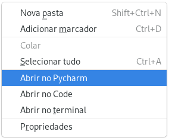

# code-nautilus

Este repositorio é uma extenção do Pycharm para o Nautilus em pt_BR.  
  


## Instalar extenção

```sh
wget -qO- https://raw.githubusercontent.com/siddarta-weis/pycharm_nautilus/master/install.sh | bash
```

## Desinstalar extenção

```sh
rm -f ~/.local/share/nautilus-python/extensions/code-nautilus.py
```
